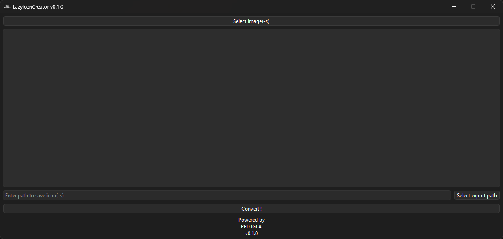
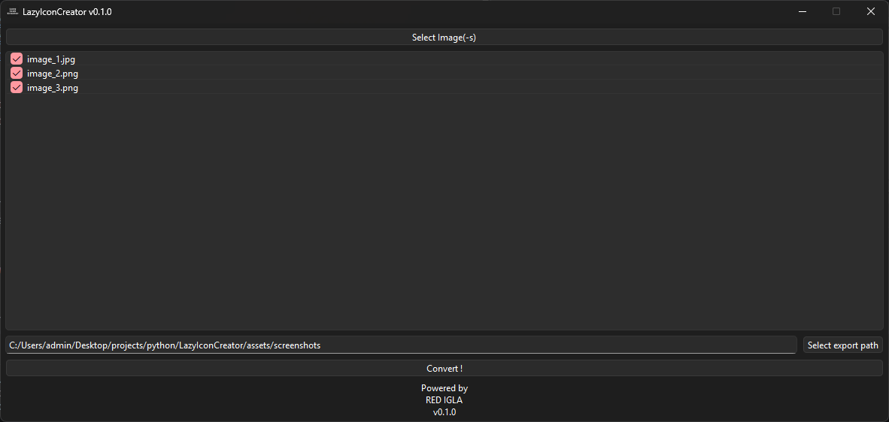

# 🖼️ LazyIconCreator

<div align="center">
   

   ### A special utility for converting images into icons

   [](https://www.python.org/)
   [](https://github.com/ProxyDDDer)
   [](LICENSE)
</div>

<div align="center">
   LazyIconCreator - A simple utility for converting images into icons.

   The icon for this utility was made in the same utility :)
</div>

<p align="center">
   
   
</p>

## ✨ Key Features

- **Support for many types of images**  
Currently supports: jpg, jpeg, png.

- **Easy to use**  
Just add the images you want to convert and click "convert"!

- **The ability to choose which images to convert**  
You can choose which images to convert using the checkboxes in the list.

- **Open the folder with converted icons immediately**  
After successful conversion, you can immediately open the export folder in the dialog box!

- **Fully portable**  
Just unzip it to a convenient place and use it!

## 🛠️ Tech

### 📄 Legal
[](LICENSE)

### 🥎 Qt(PySide6)
This project uses **PySide6** (Qt for Python), which is licensed under **LGPL v3**. 
For more details, please visit the [Official Qt Licensing page](https://www.qt.io/licensing/).

## ⚙️ Installation

### 🖥️ Windows

1. Go to [Releases](https://github.com/ProxyDDDer/LazyIconCreator/releases) page.
2. Download the latest `Release`.
3. Unzip and run `LazyIconCreator.exe`!

### ⚙️ Manual Installation

#### 1. Clone the repository
```bash
git clone https://github.com/ProxyDDDer/LazyIconCreator.git
cd LazyIconCreator
```
#### 2. Create a virtual environment (optional but recommended)
```bash
python -m venv venv

# Windows:
venv\scripts\activate

# macOS/Linux:
source venv/bin/activate
```

#### 3. Install requirements
```bash
pip install -r requirements.txt
```

#### 4. Run the application
```bash
python main.py
```